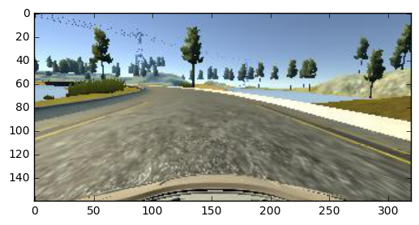

**1. Architecture**  
I used the Nvidia pipeline as described in http://images.nvidia.com/content/tegra/automotive/images/2016/solutions/pdf/end-to-end-dl-using-px.pdf. I made a couple of minor modifications to the pipeline by adding a cropping layer to remove 35 pixels from the top of each image. I added dropout (0.2) layer before the first fully connected layer - only because it appears to be a requirement in the project rubric. A dropout layers appears to hurt the model more that it helps (maybe because there is not a lot of data to start with?). This project benefits more from data augmentation than from fine-tuning the model. 
   
The number of layers and sizes for each layer:   

Normalization layer - Output size: (160, 320, 3)  
Cropping layer 1 - Output size:  (124, 318, 3)  
Convolution layer 1 - Output size:  (60, 157, 24)  
Convolution layer 2 - Output size:  (28, 77, 36)  
Convolution layer 3 - Output size:  (12, 37, 48)  
Convolution layer 4 - Output size:  (10, 35, 64)  
Convolution layer 5 - Output size:  (8, 33, 64)  
Flatten - Output size:  (16896)    
Dropout layer (0.2) - Output size:  (16896)     
Fully connected layer 1 - Output size:  (100)  
Fully connected layer 2 - Output size:  (50)  
Fully connected layer 3 - Output size:  (10) 

 

**2. Data augmentation**  
I used the Udacity provided data set to train the model. The car could not successfully complete either of the two tracks if I simply trained the data with the Nvidia model. Specifically, the car could not negotiate turns very well. Based on suggestions on the Udacity forums and trial and error, I settled on the following augmentation steps.   

***Discard 50% of the data with steering angle 0***    
The following histogram shows that the data set was skewed very heavily towards data with steering angle equal to 0. Training on this data set meant that car did not handle curves very well. In each batch, I discarded, at random, 50% of data samples with steering angle 0.    

***Histogram of steering angles***    
   

For each data sample, I also selected the image from center, left or right camera with equal probability. I added a small steering offset when the left or right images were selected so as to bias the car to return to the center of the lane. Here are images from the center, left and right cameras.

***Left image***   

***Center image***   

***Right image***   

***Add random brightness to each image***      
Since the second track has much different lighting and brightness than track 1, I adjusted each image by a random amount of brightness. This was based on the recommendations made by Vivek Yadav in the post: https://chatbotslife.com/using-augmentation-to-mimic-human-driving-496b569760a9#.8btw7h59y  
Here is an example of an image with brightness adjustment: 
 
***Original image***   

***Brightness adjusted image***   

***Translate each image vertically & horizontally***      
The augmentation steps performed so far helped the car complete track 1 successfully and the car did well in track 2 except for one very sharp curve. I added a random translation to each image (again based on the Vivek Yadav post) in the vertical and horizontal direction. Here is an example of a translated image:   

***Original images***   
   

***Translated images***   

***Other training details***   
I split the data set into a training and validation set (20%). I used a Python generator for generating data samples for each batch. I used the Adam optimizer, batch size of 128 and 5 epochs. I modified drive.py to set the throttle based on current speed and not have a constant throttle. This helps the car not overspeed in down hill situations and helped overcome a steep hill in track 2.   

In my testing, the car is able to successfully navigate both the tracks (screen resolution 640x480, graphics quality: fastest).
